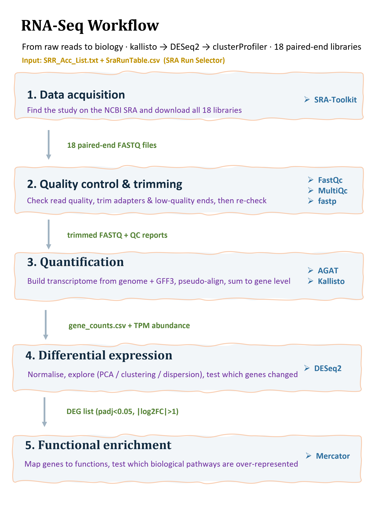

# Chilling Stress in Rice : an RNA-Seq Story

*What happens inside a rice plant when it gets cold at exactly the wrong moment and can I see it in the data myself?*

A published study once asked it; I decided to answer it again from scratch, with my own hands and my own tools, to see if I'd arrive at the same place. This README is the story of that journey, written so that someone who has never touched RNA-Seq before can follow every step and understand not just *what* I did, but *why*.

Note: Read it top to bottom like a story. By the end you'll understand a full RNA-Seq analysis.


> **The paper I'm reproducing:** Guo *et al.* (2020), *Global analysis of differentially expressed genes between two Japonica rice varieties induced by low temperature during the booting stage by RNA-Seq.* **R. Soc. Open Sci.** 7: 192243 · https://doi.org/10.1098/rsos.192243

**Project workflow:**



---

## Why rice, why cold?

Rice came from the warm tropics, and it never quite got over it. There's one moment in its life — the **booting stage**, just before the flower opens, when the pollen is being built — where a few cold nights can ruin everything. The plant doesn't die; it just fails to make grain. The husks come out **empty**.

The original study lined up two varieties side by side and chilled them both:

| Variety | What it does in the cold | Why it's here |
|---|---|---|
| **LJ25** | shrugs it off — **tolerant** | the plant that *copes* |
| **LJ11** | collapses — **sensitive** | the plant that *fails* |

Both were kept at **12 °C** and sampled at **0, 2, and 4 days** (day 0 = the "before cold" control), with **3 repeats each**. The big question: *which genes make the difference between coping and failing?*

My job was to take the raw sequencing data from that experiment and see whether I could recover the same answer.


---

## First time in a terminal? 

Don't worry! I've attached a file [2_Bash_git_cheatsheet.ipynb](2_Bash_git_cheatsheet.ipynb/) with the handful of bash commands you'll actually need. Skim it first to get comfortable moving around the command line, then come back and follow the steps.


## The data I started with

Everything is public. The reads live on the NCBI **SRA** (Sequence Read Archive):

| Thing | Detail |
|---|---|
| Accessions | **SRR7983077 → SRR7983094** (18 libraries) |
| Design | 2 varieties × 3 timepoints × 3 replicates = **18 samples** |
| Reads | **Illumina, paired-end** (each sample = a `_1` and a `_2` FASTQ file) |
| Organism | *Oryza sativa* (japonica rice) |

> **A small but important note on the labels.** In the SRA metadata table (`SraRunTable.csv`), the two **varieties** show up under a column called `tissue` (as `anther-1` / `anther-2`), and the **cold duration** shows up under `dev_stage`. So whenever you see "tissue" in the code, read it as "which variety," and "dev_stage" as "how many days of cold." This trips people up — now it won't trip you.

---

## What you need to run this

All the tools are pinned in [`RNAseq.yml`](RNAseq.yml/). One command builds the whole environment:

```bash
conda env create -f RNAseq.yml
conda activate RNAseq
```

Here's the cast of tools and the one job each one does:

| Step | Tool | Its one job |
|---|---|---|
| Get data | **SRA-Toolkit** | download the reads from the SRA |
| Check quality | **FastQC** + **MultiQC** | are the reads any good? |
| Clean up | **fastp** | trim off adapters and bad ends |
| Reference | **AGAT** | pull transcript & protein sequences out of the genome annotation |
| Count genes | **kallisto** | quickly match reads to transcripts |
| Tidy counts | **tximport** (R) | turn transcripts into gene-level counts |
| Find changes | **DESeq2** (R) | which genes actually changed? |
| Make sense of it | **Mercator** + **clusterProfiler** (R) | which *pathways* changed? |

>  **Tip from experience:** clusterProfiler can be fussy about R package versions. If the enrichment step throws errors, give it its own clean environment:
> ```bash
> conda create -n Renv bioconda::bioconductor-clusterprofiler conda-forge::r-tidyverse conda-forge::r-irkernel -y
> ```

---

## The journey - one notebook per step

The analysis is five notebooks, and they run in order. The trick to understanding the whole thing is this: **each notebook hands a file to the next one.** Nobody edits anything by hand. That's what makes it reproducible.


```
   3            4              5               6                 7
download → clean & check → count genes → find the changes → explain the biology
 FASTQ        trimmed        gene counts       DEG list          pathways
```

*(The `1_cluster_setup_venv` and `2_Bash_git_cheatsheet` notebooks are just the course setup — logging into the server and using Git & bash. The real analysis is notebooks 3–7.)*

---

### Step 3 - Find and download the data
**Notebook:** [`3_Finding_datasets_data_download.ipynb`](3_Finding_datasets_data_download.ipynb/)

**The idea:** you can't analyse data you don't have. I went to the [SRA search](https://www.ncbi.nlm.nih.gov/sra/advanced), filtered for this rice experiment, and sent the results to the **Run Selector**, which gives you two little files: a list of accession numbers [`SRR_Acc_List.txt`](Data/SRR_Acc_List.txt/) and a metadata sheet [`SraRunTable.csv`](Data/SraRunTable.csv/). Then I let the SRA-Toolkit fetch every run.

```bash
prefetch -r yes $(cat SRR_Acc_List.txt)          # stage each run
for i in $(cat SRR_Acc_List.txt); do
    fasterq-dump "$i"                            # turn it into FASTQ
done
```

**Why it matters:** starting from a fixed, written-down list of accessions means anyone including future me can get the *exact* same data. That's reproducibility, step one.

**You end up with:** 18 pairs of raw FASTQ files.

---

### Step 4 - Clean the reads and check they're good
**Notebook:** [`4_Pre-processing_QC_trimming.ipynb`](4_Pre-processing_QC_trimming.ipynb/)

**The idea:** sequencing is never perfect. Reads pick up leftover **adapter** sequence and get sloppy near their ends. Before trusting anything, you look at the quality (**FastQC**, summarised across all samples by **MultiQC**), then trim the junk with **fastp**, then look *again* to prove the cleaning worked.

```bash
fastqc *.fastq && multiqc .                      # look before
fastp -i sample_1.fastq -I sample_2.fastq \      # clean (paired mode)
      -o out_1.fastq   -O out_2.fastq
fastqc trimmed/*.fastq && multiqc trimmed/       # look after
```
To view the full quality control report, you need to download the HTML file and open it locally in your web browser
[**Multiqc report before trimming**](Results/1_Quality_control/1.multiqc_report_before_trimming.html) 
[**Multiqc report After trimming**](Results/1_Quality_control/2.multiqc_report_after_trimming.html) 


**How to read the QC reports (the five things I check):**
- **Per-base quality** — I want most of the read sitting above **Q30** (99.9 % accurate). A small dip at the very end is normal.
- **Reads per sample** — every library should have enough, and none should have failed.
- **GC content** — one smooth peak = a clean library; a double peak would hint at contamination.
- **Adapter content** — should drop to basically zero after trimming.
- **Duplication** — high here (50–65 %) and *that's fine*  RNA-Seq makes many copies of busy genes on purpose.

> **Something I noticed:** the "before" and "after" reports look almost identical. That's because the reads on the SRA were already the authors' *cleaned* reads, so fastp had very little left to do. Worth knowing, not a mistake.

**You end up with:** trimmed FASTQ files, ready to count.

---

### Step 5 - Turn reads into gene counts
**Notebook:** [`5_mapping_practical_Kallisto.ipynb`](5_mapping_practical_Kallisto.ipynb/)

**The idea:** now I need to know *how much* of each gene each sample made. I used **kallisto**, which is clever and fast: instead of slowly aligning every read letter-by-letter to the whole genome (a plant genome is huge and eats memory), it chops reads into short "words" (k-mers) and matches them to a catalogue of transcripts. This is called **pseudo-alignment**.

The recipe:
1. Download the rice genome + annotation, and use **AGAT** to pull out the transcript sequences.
2. Build a kallisto **index** of those transcripts.
3. Run `kallisto quant` on all 18 samples.
4. In R, build a `tx2gene` table (which transcript belongs to which gene) and use **tximport** to add transcripts up into **genes**.

**Why kallisto and not STAR/HISAT2?** Because rice is already well-annotated (I don't need to discover new genes), I only need gene-level counts, and pseudo-alignment gives me that in a fraction of the time and memory. It's the right tool for *this* job.

**You end up with two tables**, each **genes × 18 samples**:
- [`gene_counts.csv`](Results/2_Kallisto%20output/gene_counts.csv/) : raw counts → the food for DESeq2.
- [`gene_counts_abundance.csv`] (Results/2_Kallisto%20output/gene_counts_abundance.csv/) — TPM (length- and depth-normalised) → used to decide which genes are "expressed enough." and helpful in filtering the low expressed genes

---

### Step 6 - Find the genes that actually changed
**Notebook:** [`6_DGE_Analysis.ipynb`](6_DGE_Analysis.ipynb)

This is the heart of it. Here's the logic, plot by plot:

**First, some housekeeping.**
- [**Library sizes**](Results/3_Plots/1_librarysize_abundance_count.png/) : a quick look showing raw counts differ between samples (different depth) while TPM is flat (normalised). 
- [**Filtering**](Results/3_Plots/2_logtranformed_before_after_filtering.png/) : I keep a gene only if it has **TPM > 1 in at least 3 samples**. That drops thousands of silent genes and takes the set from **~55,986 down to ~26,916** worth testing.

note: the results are uploads in a Results dataframe
**Then, look at the big picture (before any statistics).**
- [**PCA**](Results/3_Plots/3.1_Pca_variance1vs2_devstage_tissue.png/) : squashes ~27,000 genes down to a couple of axes and plots each sample as a dot. Similar samples land together. Here **PC1 alone explains 57 %** of all the variation, and cold-treated samples pull away from the controls — meaning *cold is the loudest signal in the data.*
- [**Scree plot**](Results/3_Plots/3.1_pca_plot_devstage_tissue.png/) : shows how much each axis is worth (57 %, 18 %, 8 %…), confirming the first two axes tell most of the story.
- [**Sample distance matrix**](Results/3_Plots/4_sample_distance_matrix.png/) : a second opinion: a heatmap where similar samples form coloured blocks. It agrees with the PCA.

**Then, run the statistics with DESeq2.**
- [**Dispersion plot**](Results/3_Plots/5_dispersion_plot.png/) : a health check on the model. The expected shape (noisy at low counts, settling as counts rise, with gene estimates shrunk toward a trend line) tells me the maths fits, so the p-values can be trusted.
- [**Volcano plot**](Results/3_Plots/6_volcano_plot.png/) : the payoff. Every gene is a dot: **left–right = how much it changed** (log2 fold change), **up = how confident we are** (−log10 adjusted p-value). The genes clearing both cut-offs are the **differentially expressed genes** — and they spread both ways, so cold turns genes both up and down.

**You end up with:** a table of significant DEGs [`deseq2_day4_filtered_results.csv`](Results/deseq2_day4_filtered_results.csv/) for the 4-day-cold vs no-cold comparison.

---

### Step 7 - Explain the biology
**Notebook:** [`7_downstream_analysis.ipynb`](7_downstream_analysis.ipynb)

**The idea:** a list of gene IDs means nothing until you ask, *what do these genes actually do?* So I took the DEGs and asked whether they pile up in any particular biological function more than chance would allow — an **enrichment test**.

The recipe: AGAT pulls the protein sequences → **Mercator** sorts every gene into functional categories (MapMan "bins") → **clusterProfiler** tests which categories my DEGs are crowded into → dot-plots show the winners.

To view the [**Mercator plot**], you need to check the [result](Results/4_Mercator%20plot/) folder


**How to read a dot-plot:** each dot is a function. Further **right** = a bigger share of my genes; **bigger** dot = more genes; **redder** = more significant.

**What came out:** the same themes at every zoom level **photosynthesis, the Calvin cycle & RuBisCO, redox/antioxidant defense, and calcium signalling.** Which is exactly the biology the original paper pointed to.

---

##  So, did it reproduce?

**Yes, where it counts.** Through a completely different pipeline (kallisto + DESeq2 instead of the paper's mapping), I still landed on the same conclusion: **cold reshapes the rice transcriptome around photosynthesis, redox defense, and calcium signalling**, and the samples separate by variety and treatment just as the paper describes.

**The exact numbers differ, and that's expected.** My DEG counts aren't identical to the paper's 13,205 — different tools and different thresholds give different totals. That's the real lesson of a reproduction: *the biology is robust, but the numbers always come with the method attached.*

---
>  **One rule:** don't commit the big files. Raw FASTQ, the genome, and the kallisto index are huge and can always be re-downloaded. Put them in `.gitignore`. Keep the repo to code, small tables, and figures.

---

## Want to run it yourself?

```bash
# 1. build the environment
conda env create -f RNAseq.yml && conda activate RNAseq

# 2. open the notebooks and run them IN ORDER: 3 -> 4 -> 5 -> 6 -> 7
jupyter lab
```

Notebooks 5, 6, and 7 switch to an **R kernel**. Edit the file paths at the top of each notebook to match where your data lives, and you're off.

**Note:** For this project, I was provided with dedicated computational resources, including access to a high-performance computing (HPC) cluster and approximately **1 TB of storage**, enabling efficient processing and analysis of large-scale RNA-seq datasets.


*This was my walk from raw reads to real biology. If you followed it here, you now know how an RNA-Seq analysis works from end to end.* 

# Acknowledgements

This project was completed as part of a comprehensive RNA-Seq course. I am deeply grateful to **Vanda Marosi** and **Amit Fenn** for their expert guidance, patient teaching, and for walking me through every step of this pipeline. Their mentorship transformed raw data into biological insight.

I also thank them for providing access to the computational resources: the HPC cluster and storage infrastructure, that made this large-scale analysis possible.

*Thank you for helping me understand not just the tools, but the science behind them.*